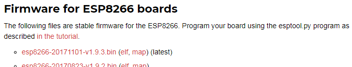
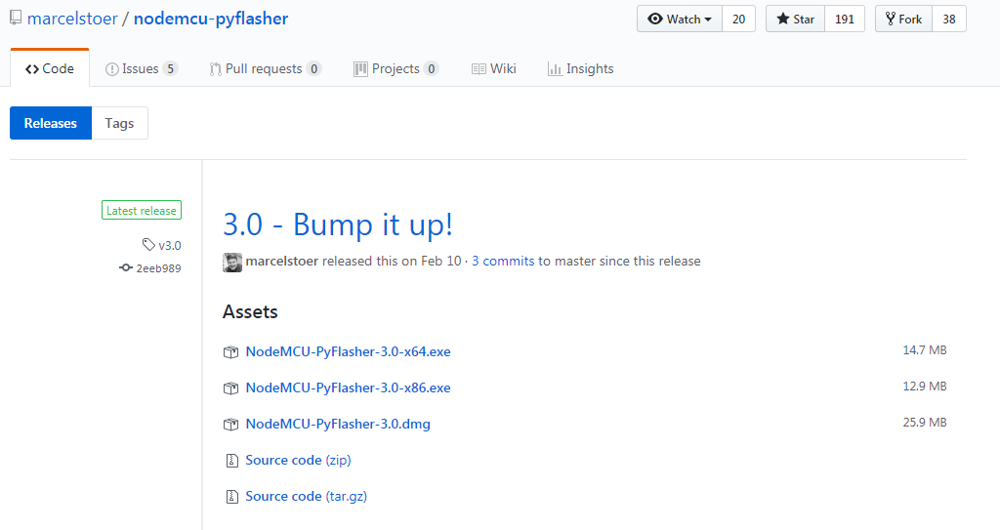
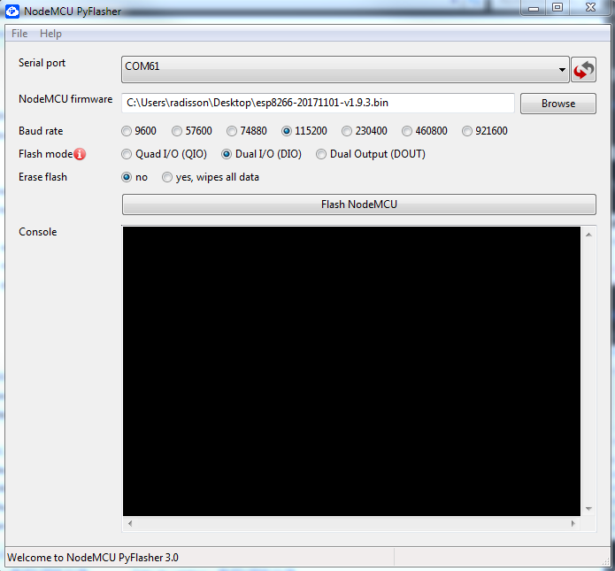
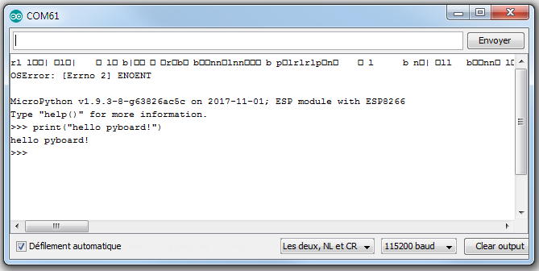
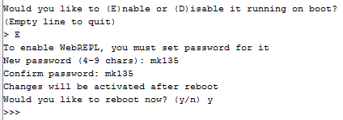
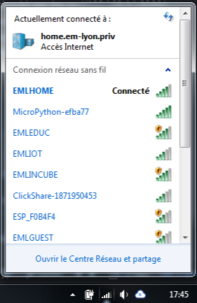
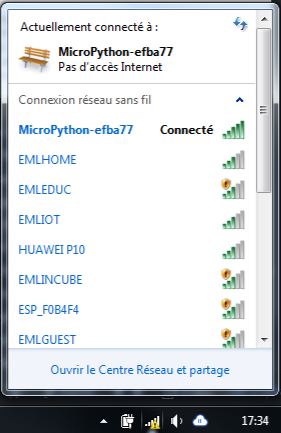

# MicroPython for ESP8266 Quick Guide
___

### What is MicroPython
MicroPython is a lean and efficient implementation of the Python 3 programming language that includes a small subset of the Python standard library and is optimised to run on microcontrollers and in constrained environments.
- [micropython.org](http://micropython.org/)
- [MicroPython Basics: What is MicroPython?](https://learn.adafruit.com/micropython-basics-what-is-micropython?view=all)


### Installing Micropython on ESP8266
Download MicroPython latest firmware (.bin file) from [MicroPython downloads](http://micropython.org/download#esp8266).


Download [NodeMCU PyFlasher](https://github.com/marcelstoer/nodemcu-pyflasher) from [releases page](https://github.com/marcelstoer/nodemcu-pyflasher/releases) (works for windows and mac).


NodeMCU PyFlasher doesn't have to be installed, just double-click it and it'll start. Select serial port form list, and MicroPython firmware (.bin file) on your computer. Then click `Flash NodeMCU` button. (NodeMCU PyFlasher was designed with NodeMCU in mind but it does a great job flashing MicroPython on esp8266 boards.)



### Using the Python REPL prompt
Launch Arduino, set the port of your board and open the Serial monitor.  
Set line ending on `NL and CR` and baudrate on `115200 baud`.  
You should be presented with a MicroPython prompt and can now run some MicroPython code on your ESP8266.  
Let’s make sure it is working with the obligatory test:  
type `print("hello pyboard!")` and press `[ENTER]`.



### Using MicroPython
You've successfully installed MicroPython on your board, congrats! Let's dig in a bit more.
Keep the Serial monitor open and type:  
`import machine` # this will add access to hardware  
You can get info on any command by typing `help(cmd)` ie: `help(machine)`  

```
import machine  
led = machine.Pin( 0, machine.Pin.OUT )
led.on()
led.off
```

[machine — functions related to the hardware](http://docs.micropython.org/en/latest/pyboard/library/machine.html)


### WebREPL
Instead of using Serial, we can control our board via a web interface:
- Type `import webrepl_setup` in order to start the WebREPL daemon on startup.  
- Type `E` to enable on boot, then type a password, finally type `y` to reboot your board.  


- We can now see a new SSID being broadcast from our board.   


- Download the webREPL files [here](https://github.com/micropython/webrepl/archive/master.zip) and extract them, then open up webrepl.html

- Connect to the Micropython SSID with the **micropythoN** password. Be careful, you'll lose internet connectivity at this point!  


- Open up webrepl.html from the webREPL files. You should see the ws://192.168.4.1:8266/ address by default in the connect window. Click `connect`, and enter the password you set earlier. You now have access to your Micropython-enabled ESP8266 board via wifi!

```
import machine  
import time
led = machine.Pin( 0, machine.Pin.OUT )
while( True ):
    led.on()
    time.sleep( 0.5 )
    led.off()
    time.sleep( 0.5 )
```  
You can escape from this loop by hitting `[Ctrl]+[C]`  


### CircuitPython
Adafruit is releasing a different flavor of MicroPython named CircuitPython. You can find documentation here:
- [Adafruit CircuitPython on Github](https://github.com/adafruit/circuitpython)
- [Adafruit CircuitPython API Reference](http://circuitpython.readthedocs.io/en/latest/docs/index.html)


### Revert to NodeMCU
If you want to revert your board to NodeMCU, latest firmware updates can be found on github: [nodemcu/nodemcu-firmware](https://github.com/nodemcu/nodemcu-firmware).  
And you can get a build [here](https://nodemcu-build.com/) by simply entering your email and click `Start your build`.

### Sources
- [The Super Easy Micropython ESP8266 Windows Guide. No Guesswork Required!](http://www.instructables.com/id/The-Super-Easy-Micropython-ESP8266-Guide-No-Guessw/)
- [Micropython basics on adafruit](https://learn.adafruit.com/search?q=micropython%20basics&)
- [MicroPython tutorial for ESP8266](https://docs.micropython.org/en/latest/esp8266/esp8266/tutorial/intro.html)
